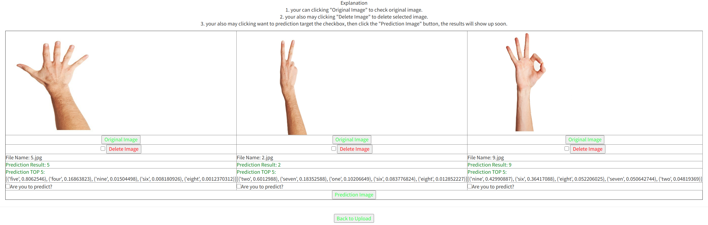
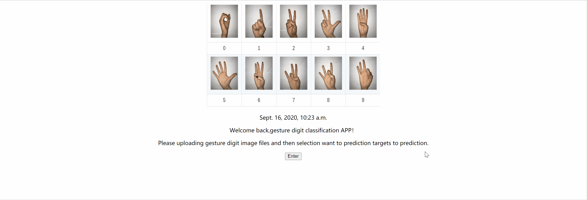

## Gesture Digit Prediction APP(Django)

This program is an image classification APP built on the Django framework, which uses the convolutional neural network VGG16 model to classify gesture digital pictures.
Use AWS's EC2 docker container to build a program environment (including tensorflow's python environment)
Deploy the program in the container, execute the django APP, and access it through the public ipv4.

这个程序是建立在 Django 框架上的图像分类 APP，利用卷积神经网络 VGG16 模型进行手势数字图片的图像分类。
利用 AWS 的 EC2 的 docker 容器搭建程序环境（包含 tensorflow 的 python 环境）
把程序部署在容器里面，执行 django APP，通过公有 ipv4 进行访问操作。

## Project Structure(结构)

```
├── db.sqlite3    This is the storage DataBase(这个是存储数据库)
├── Dockerfile   The is the Dockerfile for generate container(这个是 Dockerfile 用来生成容器)
├── hello              Application of project( 项目的应用程序APP)
│   ├── admin.py
│   ├── apps.py
│   ├── __init__.py
│   ├── migrations
│   │   ├── 0001_initial.py
│   │   ├── 0003_hello1.py
│   │   ├── 0004_img.py
│   │   ├── __init__.py
│   ├── models.py
│   ├── templates
│   │   └── hello
│   │   ├── index.html
│   │   ├── showing.html
│   │   └── uploading.html
│   ├── urls.py
│   └── views.py   perform module of program(contain pre-processing, prediction, uploading file, show and delete of picture )程序的执行模块（包括 预测前处理，预测处理，文件上传处理，图片的显示删除操作）
├── manage.py      django management file
├── media                This is the storage upload picture(这个用来存放上传图片)
│   └── file
│   └── __init__.py
├── model                  This is folder storage VGG16 model (这个文件夹存放 VGG16 模型)
│   └── sign_language_vgg16_1.h5
├── mysite                 This is the django framework setting files(这个是 django 框架设定文件)
│   ├── __init__.py
│   ├── settings.py
│   ├── urls.py
│   └── wsgi.py
├── requirements.txt       This is the project running need requirements file of package (这个是程序运行需要的 package 的请求文件)
└── static                               This is django framework static folder, that for storage static files(这个是 django 框架的 static 文件夹，用来放静态文件)
├── css
│   ├── bootstrap.min.css
│   └── style.css
└── img
└── digit.png
```

## Program deployment and execution method(程序部署和执行方法)

### deployment method(部署方法)：

1. 登陆 AWS 的 EC2 然后创建实例。
2. 在实例上安装 docker 环境
3. 利用 Dockerfile 创建容器（Dockerfile 里面已经包含执行 requirements 命令）  
   docker build -t gesture_classificaiton:1.0 .
4. 执行下面的命令启动容器并执行 django 程序  
   docker run -it --rm -p 8000:8000 gesture_classificaiton:1.0
5. 利用浏览器打开 URL（公有 ipv4:8000）

---

1. Log in to AWS EC2 and create an instance.
2. Install the docker environment on the instance
3. Use Dockerfile to create a container (Dockerfile already contains the requirements command)  
   docker build -t gesture_classificaiton:1.0 .
4. Execute the following command to start the container and execute the django program  
   docker run -it --rm -p 8000:8000 gesture_classificaiton:1.0
5. Use browser to open the URL (public ipv4:8000)

## Result show(结果演示)

### Prediction result show(预测结果显示)



### Demo video(动画演示视频)



## Contact us(联系我)

Send your inquiries to [QiuLongquan](qiulongquan19851234@gmail.com).

Sep, 2020
